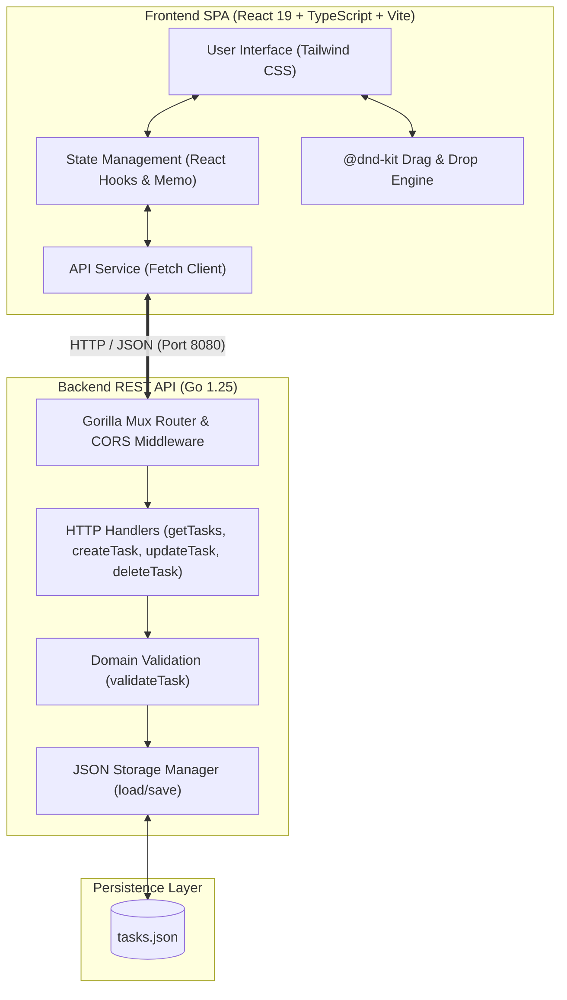

# 🏢 TaskFlow Workspace - Veritas Consultoria Empresarial

[](https://go.dev/)
[](https://react.dev/)
[](https://www.typescriptlang.org/)
[](https://vite.dev/)
[](https://tailwindcss.com/)
[](https://dndkit.com/)

> 🇺🇸 **English** | 🇧🇷 [**Versão em Português**](README.md)

**TaskFlow Workspace** is a high-performance Full Stack application designed for agile project and task management with dual views (Kanban Board and List/Table view). Developed as a technical challenge solution for **Veritas Consultoria Empresarial**, the project focuses on clean architecture, strict typing, modularization, real-time KPI metrics, and smooth drag-and-drop interactions.

## 📌 Quick Navigation

- [📝 About the Project](#-about-the-project)
- [🖼️ Preview](#️-preview)
- [⚡ API Endpoints](#-api-endpoints)
- [✨ Features](#-features)
- [🛠️ Technologies and Tools](#️-technologies-and-tools)
- [🏛️ Solution Architecture](#️-solution-architecture)
- [📁 Repository Structure](#-repository-structure)
- [💡 Technical Decisions](#-technical-decisions)
- [🚀 How to Run the Project](#-how-to-run-the-project)

## 📝 About the Project

**TaskFlow** was built in a SaaS Workspace format for team or individual productivity management. The system provides synchronized state across multiple workflow perspectives:

- **Backend with Go (Golang)**: Clean and decoupled RESTful architecture using `gorilla/mux` for routing, `rs/cors` for CORS control, atomic JSON persistence, and comprehensive unit tests with `httptest`.
- **Frontend with React 19 + TypeScript + Vite**: Single Page Application (SPA) with a solid dark mode design system (slate/indigo palette), keyboard shortcuts, and `@dnd-kit` (Core & Sortable) integration for accessible and fluid drag-and-drop card movements.

## 🖼️ Preview


## ⚡ API Endpoints

The backend RESTful API runs by default on port `8080` and exposes the following endpoints:

| Method | Route | Description | Success Status | Error Status |
| :--- | :--- | :--- | :---: | :---: |
| `GET` | `/tasks` | Retrieves all registered tasks | `200 OK` | `500 Internal Server Error` |
| `POST` | `/tasks` | Creates a new task with payload validation | `201 Created` | `400 Bad Request`, `500 Internal Server Error` |
| `PUT` | `/tasks/{id}` | Updates task title, description, status, priority, and category | `200 OK` | `400 Bad Request`, `404 Not Found`, `500 Internal Server Error` |
| `DELETE` | `/tasks/{id}` | Permanently deletes a task by its identifier | `204 No Content` | `404 Not Found`, `500 Internal Server Error` |

### Sample Payload (Task)

```json
{
  "id": 1,
  "title": "Build technical documentation",
  "status": "em progresso",
  "description": "Write comprehensive README and REST API documentation",
  "priority": "alta",
  "category": "Backend",
  "dueDate": "2026-10-15"
}
```

## ✨ Features

- **🗂️ Dual View Workspace:**
  - **Dynamic Kanban Board:** 3 status columns (*A Fazer*, *Em Progresso*, *Concluídas*) with full Drag & Drop capabilities and internal sorting.
  - **Executive List/Table View:** Structured rows with inline status selection dropdowns and direct deletion.
- **📊 Real-Time Metrics & KPIs Bar:**
  - Instant indicators for *Total Tasks*, *To Do*, *In Progress*, *Completed*, and dynamic *Completion Rate (%)*.
- **🔍 Real-Time Search and Multi-Filter:**
  - Global real-time search across titles, descriptions, and categories.
  - Multi-dimensional filtering by Priority (*Alta*, *Média*, *Baixa*) and Category (*Frontend*, *Backend*, *Design*, *Bug*, *Melhoria*, *Geral*).
  - Status isolation filter in the sidebar that highlights the focused column.
- **⌨️ Keyboard Shortcuts (Power User):**
  - Press `/` : Quick focus on global search input.
  - Press `N` : Instantly open the New Task creation modal.
- **📝 Complete Modals for Creation & Editing:**
  - Client and server-side validation for dates, priorities, categories, and descriptions.
- **🗑️ Safe Deletion:**
  - Interactive confirmation dialog to avoid accidental removals.
- **💾 Reliable Persistence & Automated Tests:**
  - Instant synchronization with Go API and file-based JSON storage.

## 🛠️ Technologies and Tools

| Layer / Purpose | Technology | Description |
| :--- | :--- | :--- |
| **Backend Language** | **Go 1.25 (Golang)** | High performance, static typing, and native concurrency |
| **HTTP Routing** | **Gorilla Mux 1.8.1** | Flexible request router and dispatcher with URL path parameters |
| **CORS Middleware** | **rs/cors 1.11.1** | Secure Cross-Origin Resource Sharing handling |
| **Data Persistence** | **JSON File Storage (`tasks.json`)** | Atomic and lightweight file persistence without database setup overhead |
| **Automated Testing** | **Go Testing Package (`testing`, `httptest`)** | Unit test suite covering all handlers, validations, and edge cases |
| **Frontend Framework** | **React 19.1** | Declarative and component-driven user interface |
| **Frontend Language** | **TypeScript 5.9** | Strict typing, interfaces, and compile-time error prevention |
| **Build Tool & Bundler** | **Vite 7.1** | Lightning-fast development environment with Hot Module Replacement (HMR) |
| **Styling & Design System** | **Tailwind CSS 4.1** | Utility-first styling with modern dark mode aesthetic |
| **Drag & Drop Interactions** | **@dnd-kit (Core & Sortable)** | Accessible, lightweight, and sensor-optimized drag-and-drop toolkit |
| **Linting & Code Quality** | **ESLint 9 & TypeScript-ESLint** | Static code analysis and code consistency checks |
| **Version Control** | **Git & GitHub** | Semantic versioning and code repository management |

## 🏛️ Solution Architecture



## 📁 Repository Structure

```text
desafio-tecnico-veritas/
├── backend/                  # Backend RESTful API in Go
│   ├── go.mod                # Go module definition and dependencies
│   ├── go.sum                # Dependency checksums
│   ├── handlers.go           # HTTP request handlers (CRUD tasks)
│   ├── handlers_test.go      # Unit tests using httptest and assertions
│   ├── main.go               # Server bootstrap, routing, and CORS configuration
│   ├── models.go             # Task model, validations, and JSON file operations
│   └── tasks.json            # JSON storage data file
├── frontend/                 # React + TypeScript + Vite SPA
│   ├── public/               # Static assets and preview GIF
│   │   └── projeto.gif       # Interface demonstration animation
│   ├── src/                  # React source code
│   │   ├── api/              # API fetch client and endpoints service
│   │   ├── components/       # Modular UI components (Kanban, List, Modals, Topbar)
│   │   ├── constants/        # Colors, categories, and priority definitions
│   │   ├── types/            # Shared TypeScript types and interfaces
│   │   ├── App.tsx           # Main application state orchestration
│   │   ├── main.tsx          # React application root entrypoint
│   │   └── index.css         # Tailwind CSS imports and base styles
│   ├── package.json          # Node dependencies and build scripts
│   ├── tailwind.config.js    # Tailwind CSS configuration
│   ├── tsconfig.json         # TypeScript compiler configurations
│   └── vite.config.ts        # Vite configuration and plugins
├── docs/                     # Additional documentation and diagrams
│   ├── README.md             # Complementary documentation guide
│   └── user-flow.png         # User flow diagram
├── README.en.md              # English documentation
└── README.md                 # Portuguese documentation (Main)
```

## 💡 Technical Decisions

### Backend (Go)
- **Separation of Concerns**: Clean modularization across `models.go`, `handlers.go`, and `main.go`, separating data definitions, storage interactions, and HTTP routing.
- **Lightweight JSON Persistence**: Storing records in `tasks.json` via native `encoding/json` and `os.Create` ensures reliable, zero-config data persistence suitable for evaluation environments.
- **`gorilla/mux` & `rs/cors`**: Robust route parsing for dynamic parameters (`{id}`) and flexible CORS middleware to enable seamless integration with the local Vite development server.
- **Automated Unit Tests**: Complete coverage in `handlers_test.go` with native `testing` and `net/http/httptest`, verifying successful CRUD flows and handling invalid payloads, non-existent records, and deletion.

### Frontend (React + TypeScript)
- **Consistent Dark Theme Design System**: High-contrast slate and solid indigo palette (`#4F46E5`), prioritizing readability, visual balance, and clean typography.
- **Smooth Drag-and-Drop with `@dnd-kit`**: Implemented using `@dnd-kit/core` and `@dnd-kit/sortable` with an activation constraint (`distance: 5px`) to prevent click/drag conflicts.
- **Reactive State Optimization**: Using `useMemo` for derived metric calculations and composite filtering (search + status + priority + category) without redundant re-renders.

## 🚀 How to Run the Project

Follow the steps below to run both the backend and frontend in your local environment.

### ⚙️ 1. Backend (Go)

1. **Prerequisites:** Ensure [Go 1.22+](https://go.dev/doc/install) is installed.
2. **Navigate to the backend folder:**
   ```bash
   cd backend
   ```
3. **Download dependencies:**
   ```bash
   go mod tidy
   ```
4. **Start the HTTP server:**
   ```bash
   go run .
   ```
   > The server will be running at: `http://localhost:8080`

5. **(Optional) Run automated tests:**
   ```bash
   go test -v ./...
   ```

### ⚛️ 2. Frontend (React + Vite)

1. **Prerequisites:** Ensure [Node.js 18+](https://nodejs.org/) is installed.
2. **Open a new terminal and navigate to the frontend folder:**
   ```bash
   cd frontend
   ```
3. **Install dependencies:**
   ```bash
   npm install
   ```
4. **Start the development server:**
   ```bash
   npm run dev
   ```
   > The application will be accessible at: `http://localhost:5173`

<div align="center">
  Developed by <strong>Ludson Pereira dos Santos</strong> 🚀<br />
  <a href="https://www.linkedin.com/in/ludson96/">LinkedIn</a> • <a href="https://github.com/ludson96">GitHub</a> • <a href="mailto:ludson_ps27@hotmail.com">E-mail</a>
</div>
