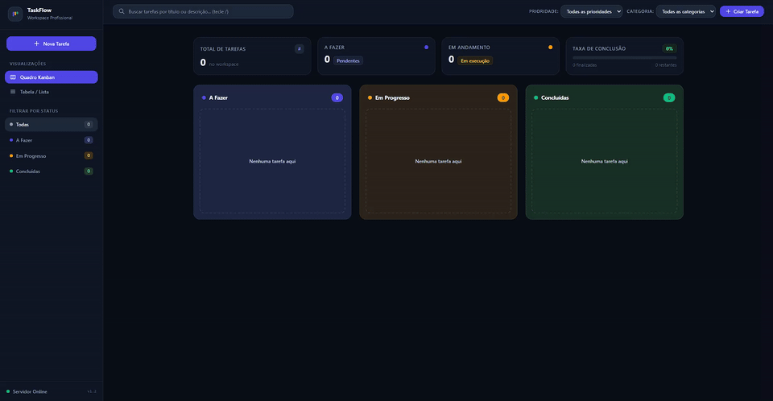
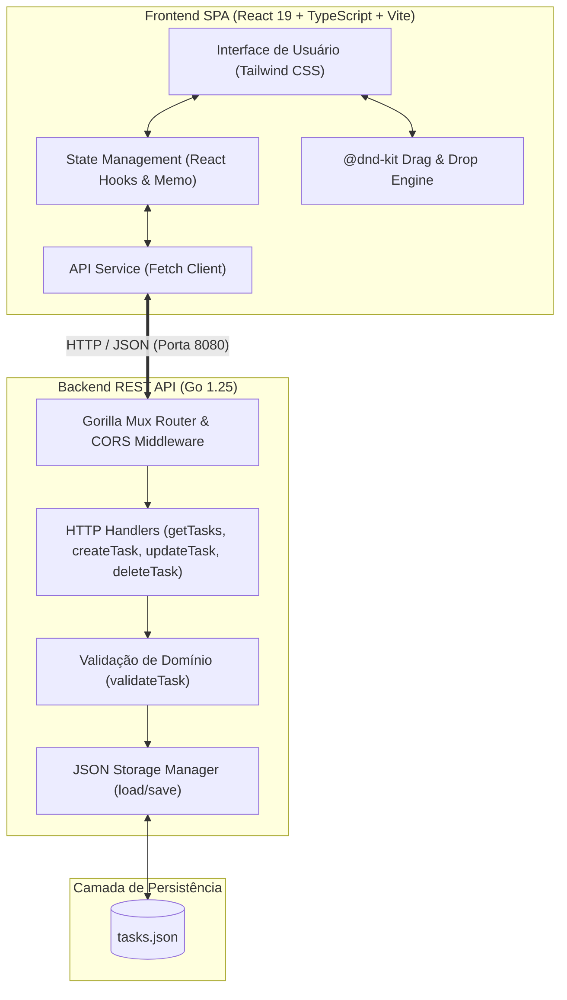

# 🏢 TaskFlow Workspace - Veritas Consultoria Empresarial

[](https://go.dev/)
[](https://react.dev/)
[](https://www.typescriptlang.org/)
[](https://vite.dev/)
[](https://tailwindcss.com/)
[](https://dndkit.com/)

> 🇧🇷 **Português** | 🇺🇸 [**English Version**](README.en.md)

O **TaskFlow Workspace** é uma aplicação Full Stack moderna de alta performance projetada para gestão visual de tarefas e fluxos ágeis de trabalho (Kanban e Lista/Tabela). O projeto foi desenvolvido como solução para o desafio técnico da **Veritas Consultoria Empresarial**, priorizando código limpo, modularização, tipagem estrita e experiência de usuário fluida com operações drag-and-drop e métricas em tempo real.

## 📌 Navegação Rápida

- [📝 Sobre o Projeto](#-sobre-o-projeto)
- [🖼️ Preview](#️-preview)
- [⚡ API Endpoints](#-api-endpoints)
- [✨ Funcionalidades](#-funcionalidades)
- [🛠️ Tecnologias e Ferramentas Utilizadas](#️-tecnologias-e-ferramentas-utilizadas)
- [🏛️ Arquitetura da Solução](#️-arquitetura-da-solução)
- [📁 Estrutura do Repositório](#-estrutura-do-repositório)
- [💡 Decisões Técnicas](#-decisões-técnicas)
- [🚀 Como Executar o Projeto](#-como-executar-o-projeto)

## 📝 Sobre o Projeto

O **TaskFlow** foi concebido no formato de Workspace SaaS para organização produtiva individual ou de times. A aplicação oferece visualizações complementares com sincronização instantânea de estado:

- **Backend em Go (Golang)**: Arquitetura RESTful enxuta e desacoplada, utilizando `gorilla/mux` para roteamento, `rs/cors` para controle de origens, persistência JSON atômica e suíte de testes unitários automatizados para todos os manipuladores HTTP.
- **Frontend em React 19 + TypeScript + Vite**: Interface SPA com design system escuro profissional (tons de slate/indigo), acessibilidade, integração da suíte `@dnd-kit` (Core & Sortable) para arraste suave entre colunas e atalhos de teclado ágeis.

## 🖼️ Preview



## ⚡ API Endpoints

A API RESTful do backend roda por padrão na porta `8080` e disponibiliza as seguintes rotas:

| Método | Rota | Descrição | Status de Sucesso | Status de Erro |
| :--- | :--- | :--- | :---: | :---: |
| `GET` | `/tasks` | Retorna todas as tarefas registradas no sistema | `200 OK` | `500 Internal Server Error` |
| `POST` | `/tasks` | Cria uma nova tarefa com validação de campos | `201 Created` | `400 Bad Request`, `500 Internal Server Error` |
| `PUT` | `/tasks/{id}` | Atualiza título, descrição, status, prioridade e categoria | `200 OK` | `400 Bad Request`, `404 Not Found`, `500 Internal Server Error` |
| `DELETE` | `/tasks/{id}` | Exclui permanentemente a tarefa pelo identificador | `204 No Content` | `404 Not Found`, `500 Internal Server Error` |

### Exemplo de Payload (Tarefa)

```json
{
  "id": 1,
  "title": "Criar documentação técnica",
  "status": "em progresso",
  "description": "Elaborar o README completo e documentação da API REST",
  "priority": "alta",
  "category": "Backend",
  "dueDate": "2026-10-15"
}
```

## ✨ Funcionalidades

- **🗂️ Workspace Multi-Visualização:**
  - **Quadro Kanban Dinâmico:** Colunas temáticas (*A Fazer*, *Em Progresso*, *Concluídas*) com suporte completo a Drag & Drop e reordenação interna.
  - **Visualização Executiva em Lista/Tabela:** Grade detalhada com ordenação, edição rápida de status inline e remoção facilitada.
- **📊 Painel de Métricas e KPIs:**
  - Indicadores em tempo real para *Total de Tarefas*, tarefas *A Fazer*, *Em Progresso*, *Concluídas* e barra de *Taxa de Conclusão (%)*.
- **🔍 Filtragem e Busca em Tempo Real:**
  - Busca global instantânea por título, descrição e categoria.
  - Filtros contextuais por Nível de Prioridade (*Alta*, *Média*, *Baixa*) e Categorias (*Frontend*, *Backend*, *Design*, *Bug*, *Melhoria*, *Geral*).
  - Filtro exclusivo por Status com isolamento de coluna na visão Kanban.
- **⌨️ Atalhos de Teclado (Power User):**
  - Tecla `/` : Foco instantâneo na barra de pesquisa global.
  - Tecla `N` : Abertura rápida do modal de criação de tarefas.
- **📝 Modais Completos de Criação e Edição:**
  - Validação estrita no cliente e servidor, permitindo gerenciar prazos, prioridades, categorias e descrições ricas.
- **🗑️ Exclusão Segura:**
  - Modal de confirmação interativo para prevenção de exclusão acidental.
- **💾 Persistência Confiável & Testes:**
  - Sincronização direta com a API Go e armazenamento estruturado em arquivo JSON local.

## 🛠️ Tecnologias e Ferramentas Utilizadas

| Camada / Finalidade | Tecnologia | Descrição |
| :--- | :--- | :--- |
| **Linguagem Backend** | **Go 1.25 (Golang)** | Performance, tipagem estática e concorrência nativa |
| **Roteamento HTTP** | **Gorilla Mux 1.8.1** | Roteador e despachante de requisições HTTP flexível com parâmetros de URL |
| **Controle de CORS** | **rs/cors 1.11.1** | Middleware para gerenciamento seguro de Cross-Origin Resource Sharing |
| **Persistência de Dados** | **JSON File Storage (`tasks.json`)** | Persistência atômica e autossuficiente sem necessidade de banco externo |
| **Testes Automatizados** | **Go Testing Package (`testing`, `httptest`)** | Suíte de testes unitários cobrindo todos os endpoints e validações |
| **Framework Frontend** | **React 19.1** | Construção declarativa e modular da interface de usuário |
| **Linguagem Frontend** | **TypeScript 5.9** | Tipagem estática, interfaces e robustez no código do cliente |
| **Build Tool & Bundler** | **Vite 7.1** | Compilação ultrarrápida com Hot Module Replacement (HMR) |
| **Estilização & Design** | **Tailwind CSS 4.1** | Estilização utility-first focada em dark mode consistente e moderno |
| **Interatividade Drag & Drop** | **@dnd-kit (Core & Sortable)** | Arraste e solte acessível e performático com sensores de toque e ponteiro |
| **Padronização & Lint** | **ESLint 9 & TypeScript-ESLint** | Análise estática e garantia de qualidade de código |
| **Controle de Versão** | **Git & GitHub** | Versionamento semântico e rastreabilidade de código |

## 🏛️ Arquitetura da Solução



## 📁 Estrutura do Repositório

```text
desafio-tecnico-veritas/
├── backend/                  # Servidor e API RESTful em Go
│   ├── go.mod                # Módulo Go e declaração de dependências
│   ├── go.sum                # Checksums e travas de versões das dependências
│   ├── handlers.go           # Controladores de requisições HTTP (CRUD de tarefas)
│   ├── handlers_test.go      # Testes unitários com httptest e asserções
│   ├── main.go               # Ponto de entrada, rotas e configuração de CORS
│   ├── models.go             # Estrutura Task, validações e leitura/escrita JSON
│   └── tasks.json            # Base de dados em formato JSON
├── frontend/                 # Aplicação SPA em React + TypeScript + Vite
│   ├── public/               # Ativos estáticos e GIF de preview
│   │   └── projeto.gif       # Animação demonstrativa da interface
│   ├── src/                  # Código-fonte da aplicação React
│   │   ├── api/              # Cliente de comunicação com o Backend (fetch)
│   │   ├── components/       # Componentes modulares (Kanban, List, Modals, Topbar)
│   │   ├── constants/        # Cores, categorias e listas de prioridades
│   │   ├── types/            # Tipos e interfaces TypeScript compartilhadas
│   │   ├── App.tsx           # Componente raiz com orquestração de estados
│   │   ├── main.tsx          # Ponto de montagem da árvore React no DOM
│   │   └── index.css         # Importações do Tailwind CSS e estilos base
│   ├── package.json          # Dependências e scripts do ecossistema Node
│   ├── tailwind.config.js    # Configurações do Tailwind CSS
│   ├── tsconfig.json         # Configurações do compilador TypeScript
│   └── vite.config.ts        # Configurações de bundling e plugins do Vite
├── docs/                     # Documentações e diagramas adicionais
│   ├── README.md             # Guia complementar de documentação
│   └── user-flow.png         # Diagrama de fluxo do usuário
└── README.md                 # Documentação principal do projeto (Português)
```

## 💡 Decisões Técnicas

### Backend (Go)
- **Modularização de Responsabilidades**: O backend foi estruturado em módulos independentes (`models.go`, `handlers.go`, `main.go`), garantindo coesão e facilidade de manutenção.
- **Persistência Leve em Arquivo JSON**: Adoção de persistência em `tasks.json` através do pacote nativo `encoding/json` e controle atômico de arquivos (`os.Create`), provendo persistência confiável sem exigir infraestrutura pesada de banco de dados para a execução da avaliação.
- **Roteamento com `gorilla/mux` & Middleware `rs/cors`**: Uso de roteador estabelecido na comunidade para extração segura de parâmetros (`{id}`) e middleware flexível para garantir compatibilidade com o cliente Vite em diferentes portas.
- **Garantia de Qualidade com Testes Automatizados**: Suíte de testes unitários em `handlers_test.go` utilizando os pacotes nativos `testing` e `net/http/httptest`, cobrindo fluxos de sucesso e cenários de erro/validação (criação inválida, recurso inexistente e exclusão).

### Frontend (React + TypeScript)
- **Design System Escuro Consistente**: Paleta de cores moderna com alto contraste em tons de cinza/chumbo e destaques em Índigo (`#4F46E5`), priorizando ergonomia visual, hierarquia tipográfica e clareza informativa.
- **Arrastar e Soltar com `@dnd-kit`**: Implementação baseada em `@dnd-kit/core` e `@dnd-kit/sortable` com `PointerSensor` configurado com distância mínima de ativação (`distance: 5px`), eliminando conflitos de clique com o início de operações de arraste.
- **Otimização de Estado Reactivo**: Utilização estratégica de `useMemo` para computação instantânea de métricas de progresso e filtragem combinada (busca + status + prioridade + categoria) sem renderizações desnecessárias.

## 🚀 Como Executar o Projeto

Siga o passo a passo abaixo para rodar o backend e o frontend em seu ambiente local.

### ⚙️ 1. Backend (Go)

1. **Pré-requisitos:** Ter o [Go 1.22+](https://go.dev/doc/install) instalado.
2. **Navegue até a pasta do backend:**
   ```bash
   cd backend
   ```
3. **Baixe as dependências:**
   ```bash
   go mod tidy
   ```
4. **Inicie o servidor HTTP:**
   ```bash
   go run .
   ```
   > O servidor estará rodando em: `http://localhost:8080`

5. **(Opcional) Executar os testes automatizados:**
   ```bash
   go test -v ./...
   ```

### ⚛️ 2. Frontend (React + Vite)

1. **Pré-requisitos:** Ter o [Node.js 18+](https://nodejs.org/) instalado.
2. **Abra um novo terminal e navegue até a pasta do frontend:**
   ```bash
   cd frontend
   ```
3. **Instale as dependências:**
   ```bash
   npm install
   ```
4. **Inicie o servidor de desenvolvimento:**
   ```bash
   npm run dev
   ```
   > A aplicação estará acessível em: `http://localhost:5173`

<div align="center">
  Desenvolvido por <strong>Ludson Pereira dos Santos</strong> 🚀<br />
  <a href="https://www.linkedin.com/in/ludson96/">LinkedIn</a> • <a href="https://github.com/ludson96">GitHub</a> • <a href="mailto:ludson_ps27@hotmail.com">E-mail</a>
</div>
